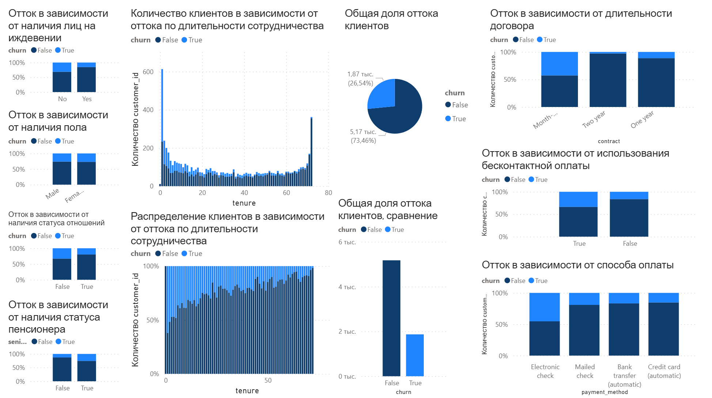
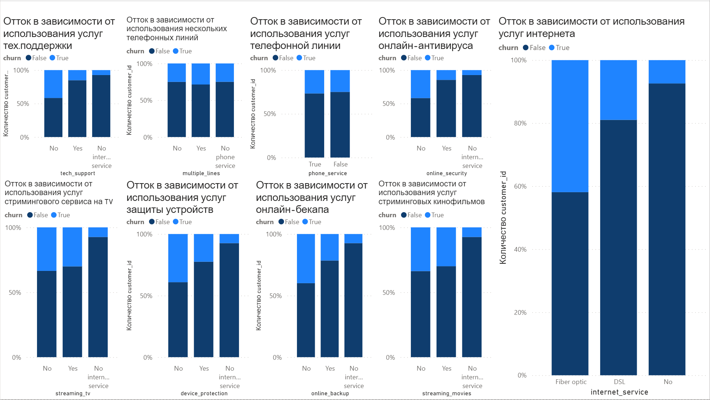

# Анализ сервиса телекоммуникационной компании (аналога Tele2, Kcell, Beeline)  

## Датасет: [Telco Churn](https://www.kaggle.com/datasets/blastchar/telco-customer-churn).   

### Обзор   
В этом проекте я проанализирую и дам практические советы стейкхолдерам телекоммуникационной компании о характере оттока их клиентов, который сможет предсказать, предотвратить отток клиентов и сэкономить деньги на маркетинговые расходы.   
 

### Выводы   
1. Главный фактор оттока клиентов - надежность сервиса. Второй месяц пользования услугами приносит 60% оттока новых клиентов, когда 60-ый (5-ый год) - менее 10%.   
2. Второй по важности фактор - возраст клиента и его семейное положение.   
  
  Об этом свидетельствует:   
  1. низкий отток лиц на иждевении,   
  2. низкий отток лиц, пользующихся контактной (чековой либо почтовой) оплатой,   
  3. низкий отток лиц, пользующихся необязательными (дополнительными) услугами - тех. поддержкой, антивирусом, услугой онлайн-бекапа, стриминговых сервисов, услугой защиты устройств,   
  Моя гипотеза состоит в том, что молодые клиенты используют только самое необходимое, а постарше - стараются обезопасить себя и готовы использовать более широ кий спектр услуг.   
  
3. На данный момент маркетинговая стратегия имеет достаточный характер. Отток клиентов - 25%, исходя из данных всех клиентов за все время.   
  
 
### Данные:  
`churn` типа `boolean` (True-False) - отток клиента   
`customer_id` типа `int` (0, 1,2,3 ...) - идентификатор клиента  
`dependents `типа `boolean` (True-False) - наличие лиц на иждевении  
`gender` типа `varchar` (male, female) - пол клиента  
`partner` типа `boolean` (True-False) - наличие статуса отношений  
`senior_citizen` типа `boolean` (True-False) - наличие статуса пенсионера  
`tenure` типа `int` (1,2,3 ...) - срок сотрудничества в месяцах  
`internet_service` типа `varchar` - наличие услуг интернета  
`multiple_lines` типа `varchar` - наличие нескольких телефонных линий  
`phone_service` типа `boolean` (True-False) - наличие услуг телефона  
`device protection` типа `varchar` - наличие услуг защиты устройств  
`online_backup` типа `varchar` - наличие услуг онлайн-бекапа  
`online_security` типа `varchar` - наличие услуг онлайн-антивируса  
`streaming_movies` типа `varchar` - наличие услуг стриминговых кинофильмов  
`streaming_tv` типа `varchar` - наличие услуг стриминговых tv-сервисов  
`tech_support` типа `varchar` - наличие услуг тех. поддержки  
`contract` типа `varchar` - тип договора  
`monthly_charges` типа `float(2)` - месячные оплаты в долларах  
`paperless_billing` типа `boolean` (True-False) - использование бесконтактной цифровой оплаты  
`payment_method` типа `varchar` - способ оплаты  
`total_charges` типа `float(2)` - общие оплаты в долларах  
  
 
### Советы для руководства 
1. Позиционировать себя как надежный провайдер телекоммуникаций  
2. Разделить маркетинг как для молодых, для людей постарше и семей. Молодым предлагать скорость и технологичность (100-500 мегабит), а постарше - надежность (тех поддержка, антивирус и т.д.).  
3. Пытаться "выкупить" клиентов других компаний предлагая им скидку или бонус за переход (люди менее склонны менять провайдера, когда пользуются им очень долго).  
4. Отдавать приоритет при решении технических проблем более "молодым" клиентам - это напрямую повлияет на отток и снизит стоймость маркетинга.  
